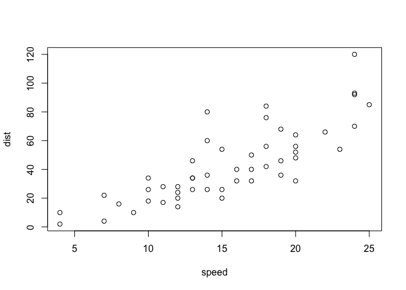

Detailed documentation on the study [A Public Domain Dataset for Human Activity Recognition Using Smartphones](https://www.elen.ucl.ac.be/Proceedings/esann/esannpdf/es2013-84.pdf "A Public Domain Dataset for Human Activity Recognition Using Smartphones")

``` {.r}
summary(cars)
```

    ##      speed           dist       
    ##  Min.   : 4.0   Min.   :  2.00  
    ##  1st Qu.:12.0   1st Qu.: 26.00  
    ##  Median :15.0   Median : 36.00  
    ##  Mean   :15.4   Mean   : 42.98  
    ##  3rd Qu.:19.0   3rd Qu.: 56.00  
    ##  Max.   :25.0   Max.   :120.00

You can also embed plots, for example:



Note that the `echo = FALSE` parameter was added to the code chunk to prevent printing of the R code that generated the plot.

================================================================== Human Activity Recognition Using Smartphones Dataset Version 1.0 ================================================================== Jorge L. Reyes-Ortiz, Davide Anguita, Alessandro Ghio, Luca Oneto. Smartlab - Non Linear Complex Systems Laboratory DITEN - Universit? degli Studi di Genova. Via Opera Pia 11A, I-16145, Genoa, Italy. <activityrecognition@smartlab.ws> www.smartlab.ws ==================================================================
